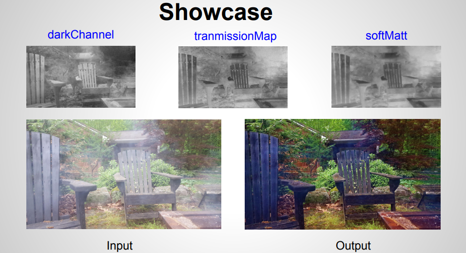
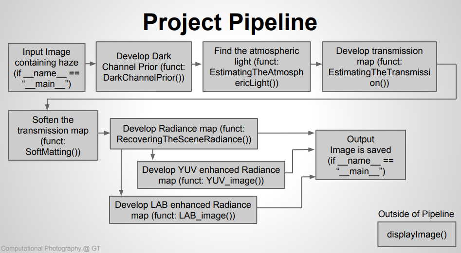
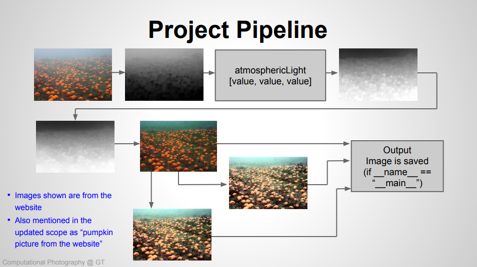

# Image Enhancement for Smoke, Haze, and Fog Removal

## Introduction

Single Image Haze Removal Using Dark Channel Prior creates a single image with all haze, fog, smoke, or other obscurities removed so that the image is clear. As introduced by Kaiming He, Jian Sun, and Xiaoou Tang, the algorithm creates a Dark Channel of the image and then estimates the amount of atmosphereic light and creates a transmission map. Soft matting is used to refine the transmission map and then the transmission map can be used to recover the scene radiance.

## Description
As developed by Kaiming He, Jian Sun, and Xiaoou Tang, Single Image Haze Removal Using Dark Channel Prior takes an obscured image and, through the developed algorithm, returns the same image enhanced without the obscuring substance. As discussed in their paper, Single Image Haze Removal Using Dark Channel Prior has a vast number of applications. By removing the particulate obstructions, we are able to provide more clear and vivid images without substancial loss.

## My Implementation
My implementation of Single Image Haze Removal Using Dark Channel Prior takes the same initial approach to the algorithm developed by Kaiming He, Jian Sun, and Xiaoou Tang but additionally ads two options for increasing lighting in the final enhanced images. 

To run results:
1. install all needed packages
2. modify the "dehaze.py" file for your desired images (~line 192)
3. run the "dehaze.py" file
NOTE: some mapping steps take a substancial amount of time (a few minutes)

## Results
The image below shows results from my implementation of the Single Image Haze Removal Using Dark Channel Prior.  
  

My developed pipeline:
  
 
